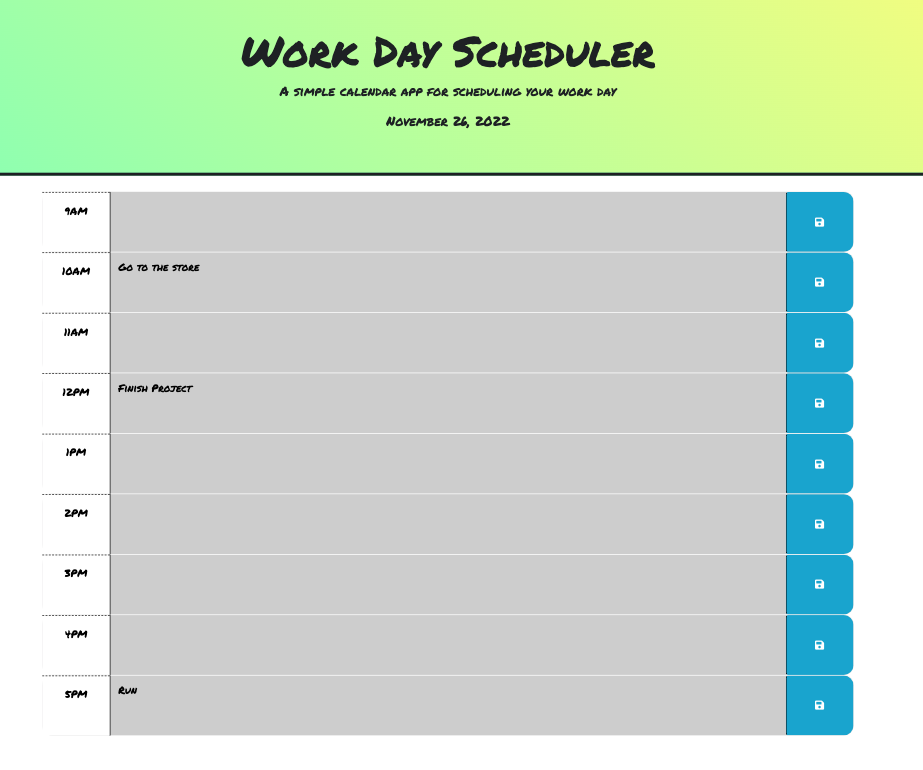

# Work-Day-Scheduler

## Description

A daily planner to help you track your important tasks and manage time effectively.

The purpose of this daily planner is to allow you to add and store tasks in hour time-blocks for a typical work day.
The items saved into the planner will be persisted through local storage, so upon refreshing or closing and reopening the planner,
the events will still remain.

## Usage

You can visit and test out the planner at the following GitHub page link provided: https://samocain93.github.io/work-day-scheduler/

```md



